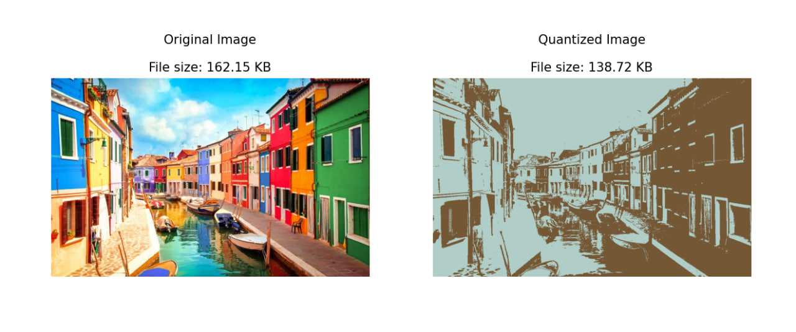
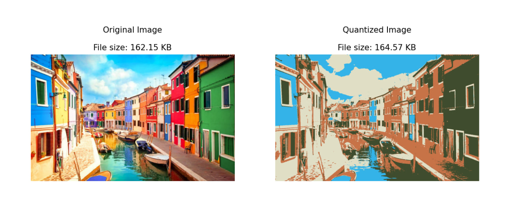
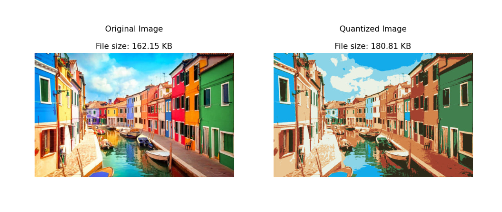

# K-Means Color Quantization

Color quantization is the process of reducing the number of distinct colors used in an image while preserving its visual appearance as much as possible. This technique is widely used in image compression, reducing the size of image files, and improving the efficiency of image processing algorithms.

In this project, we implement a color quantization algorithm using **K-Means clustering**. K-Means clustering is an unsupervised machine learning algorithm that partitions data into a predetermined number of clusters. By applying this algorithm to the colors in an image, we reduce the image to a limited palette of representative colors.

### Objectives
1. **Understand the K-Means Clustering Algorithm** – Learn how the K-Means algorithm works and how it can be applied to color data.
2. **Implement K-Means from Scratch** – Perform clustering without relying on built-in ML libraries.
3. **Perform Color Quantization** – Apply the custom K-Means implementation to reduce an image's color palette.
4. **Visualize Results** – Display side-by-side comparisons of original and quantized images.
5. **Enhance Compression** – Observe how fewer colors lead to smaller image file sizes.

## 🎨 Examples

### K = 2

  

### K = 4

  

### K = 8

  

## Features
- **Random centroid initialization** using actual pixel samples.
- **Efficient vectorized distance calculation** with NumPy.
- **Centroid update based on pixel mean per cluster**.
- **Early stopping** when centroids converge.
- **Flexible K selection** to explore the trade-off between quality and compression.
- **Pixel re-coloring and image reshaping** into original dimensions.
- **Compatible with any RGB image** using PIL or OpenCV.

